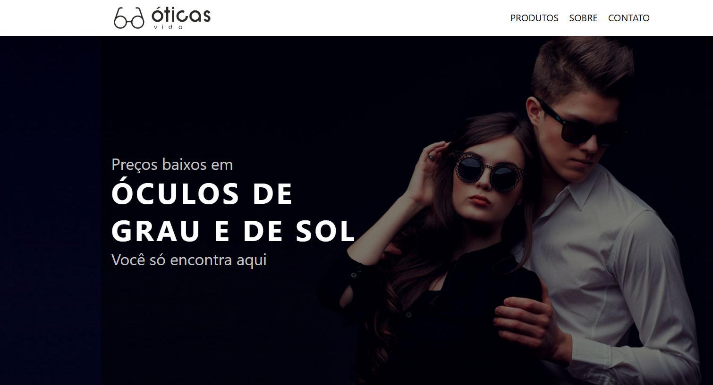
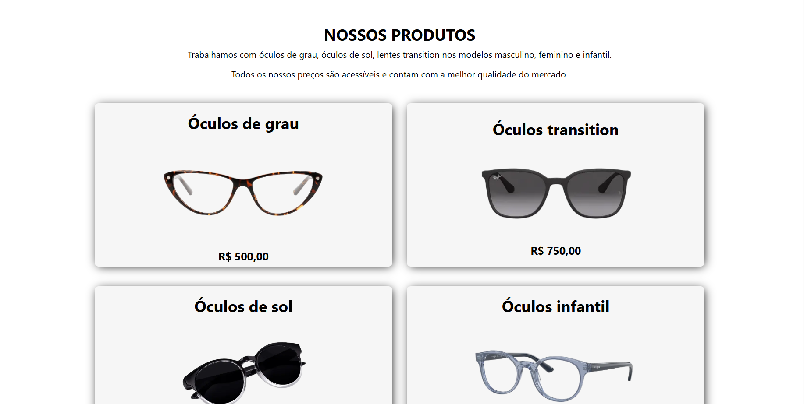
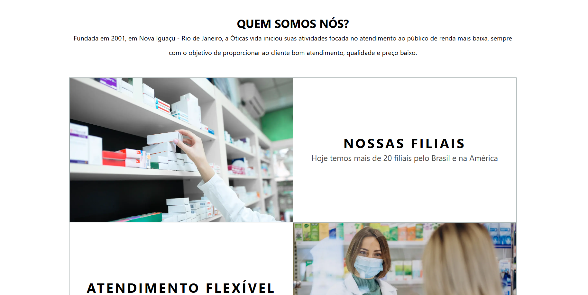
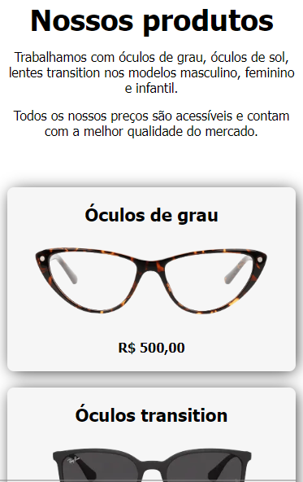

**Loja Otica**
================

Nesse projeto foi possivel colocar em pratica os siguentes conhecimentos: 
-Criar o projeto com React-Next.js.
-Componentizar o projeto da melhor forma possível.
-Responsividade.

**Seções**
-----------

**Responsividade**
-------------

**Uso**
-------------

É um layout de facil usabilidade!